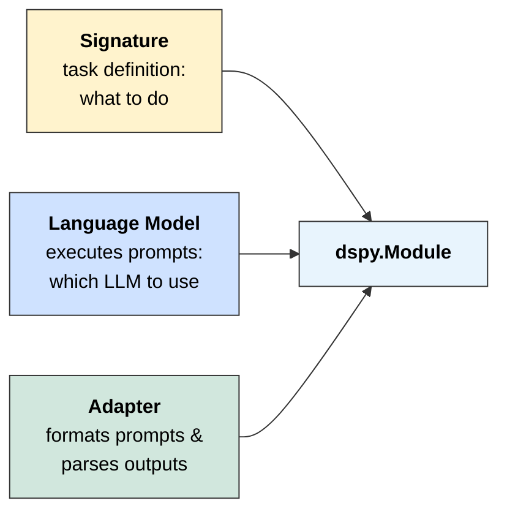
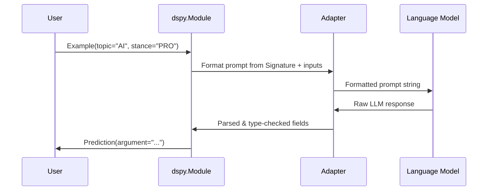

# **Background: DSPy Primitives**

This project is built on **DSPy**, leveraging its modular approach to prompt engineering. DSPy separates **what** a task does ([Signature](https://dspy.ai/learn/programming/signatures/)) from **how** it's executed ([Module](https://dspy.ai/learn/programming/modules/) + [Adapter](https://dspy.ai/learn/programming/adapters/) + [LM](https://dspy.ai/learn/programming/language_models/)).

<table>
<tr>
<th align="left">Primitive</th>
<th align="left">Purpose</th>
<th align="left">Example</th>
</tr>
<tr>
<td rowspan="3" valign="middle"><b>Fields</b></td>
<td rowspan="3" valign="middle">Define input/output schema with descriptions</td>
<td><code>topic: str = InputField(desc="The debate topic")</code></td>
</tr>
<tr>
<td><code>stance: Literal["PRO", "ANTI"] = InputField(desc="Position to argue")</code></td>
</tr>
<tr>
<td><code>argument: str = OutputField(desc="The generated argument")</code></td>
</tr>
<tr>
<td><b>Signatures</b></td>
<td>Declarative task specification (what to do)</td>
<td><code>generate_argument = "topic: str, stance: Literal['PRO', 'ANTI'] -> argument: str"</code></td>
</tr>
<tr>
<td><b>Modules</b></td>
<td>Parameterized layers that execute signatures</td>
<td><code>dspy.Predict(generate_argument)</code></td>
</tr>
<tr>
<td><b>Adapters</b></td>
<td>Format prompts from signatures; parse LLM outputs by extracting and type-checking values for each <code>OutputField</code></td>
<td><code>ChatAdapter</code>, <code>JSONAdapter</code></td>
</tr>
</table>

Signatures can be defined through class-based definitions, as shown in the [Signatures page of "Learn DSPy"](https://dspy.ai/learn/programming/signatures/#class-based-dspy-signatures). For example:

```python
class GenerateArgument(dspy.Signature):
    topic: str = dspy.InputField(desc="The debate topic")
    stance: Literal["PRO", "ANTI"] = dspy.InputField(desc="Position to argue")
    argument: str = dspy.OutputField(desc="The generated argument")
```

#### **Instantiation Phase**

A Module is created by combining a **Signature** (task definition) with a **Language Model** (executes prompts) and **Adapter** (formats prompts and parses outputs).
The Signature specifies *what* to do; the LM and Adapter determine *how*.



#### **Forward (Inference) Phase**

When the Module is called with an [**Example**](https://dspy.ai/learn/evaluation/data/#dspy-example-objects) (which contains values for input fields matching the Signature), the Adapter formats a prompt, the LM generates a response, and the Adapter parses it back into structured fields returned as a **Prediction**. See additional details about Adapters in the [Adapters documentation](https://dspy.ai/learn/programming/adapters/), more on Language Models in the [LM documentation](https://dspy.ai/learn/programming/language_models/), and about Modules in the [Modules documentation](https://dspy.ai/learn/programming/modules/).


