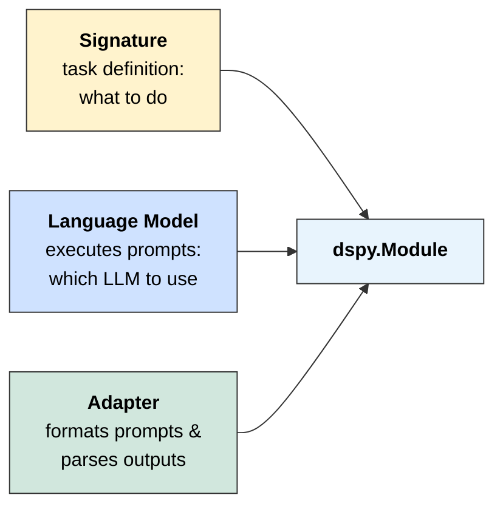
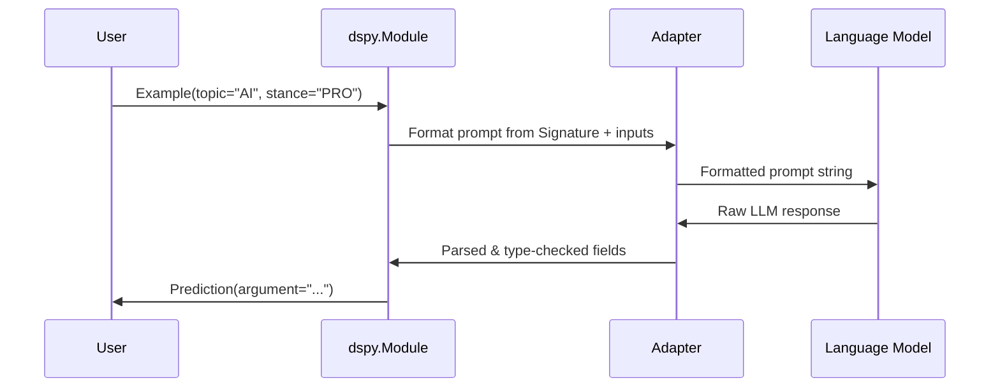
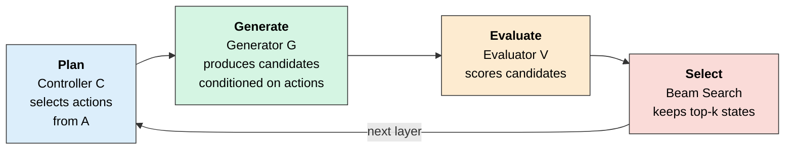
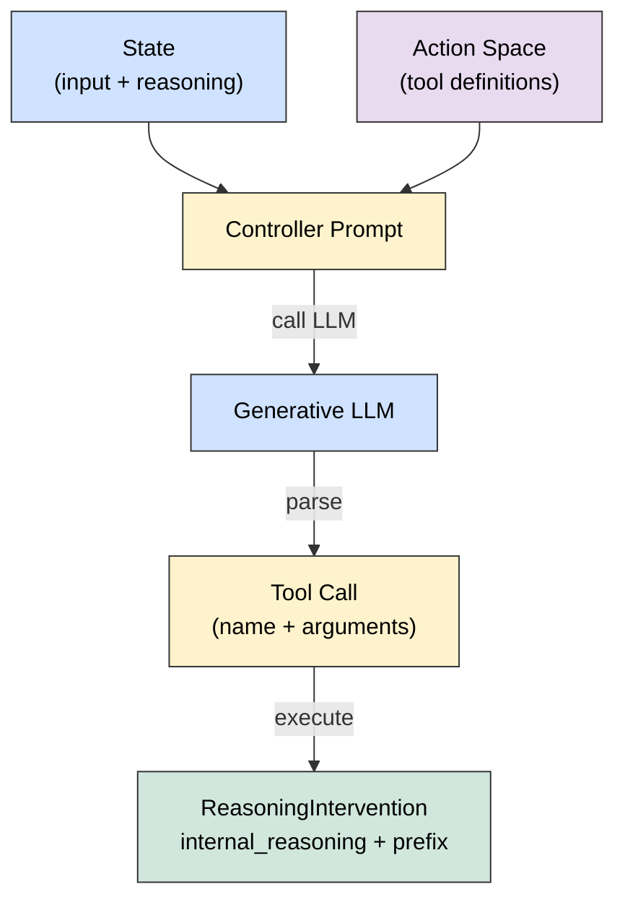
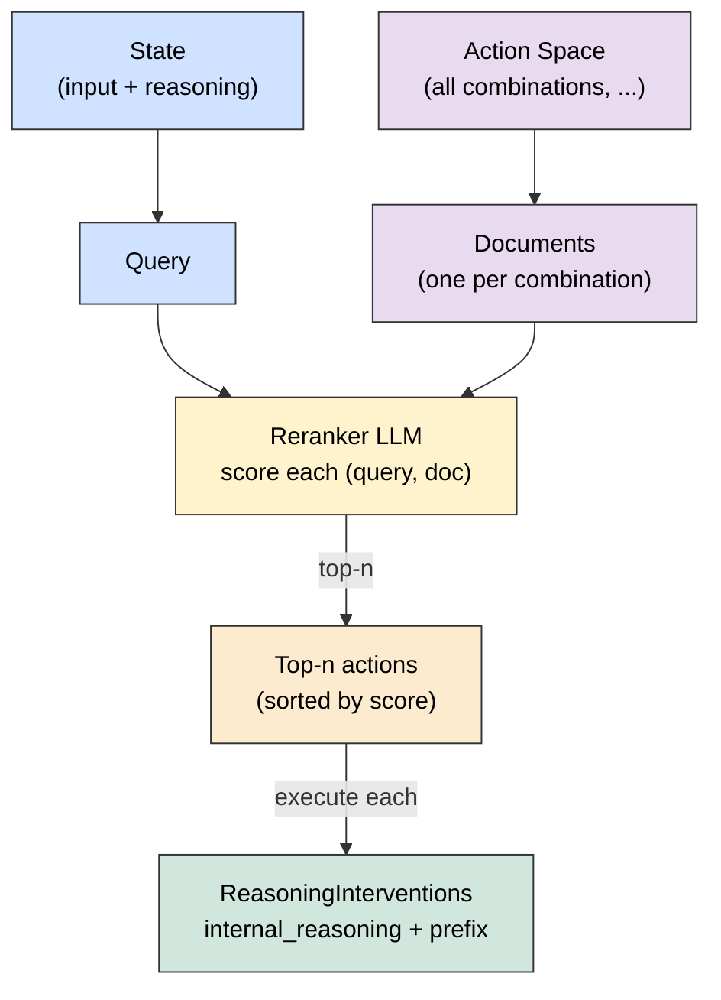
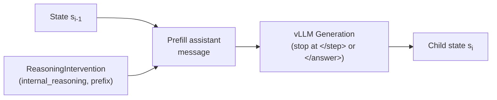
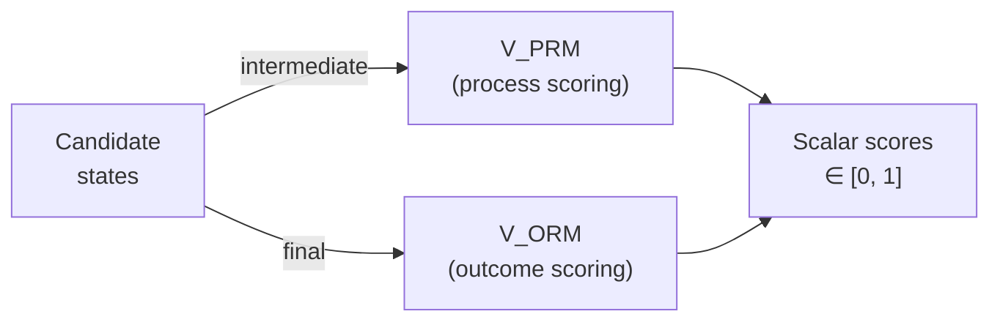
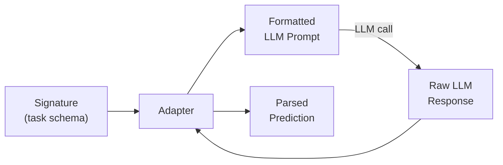
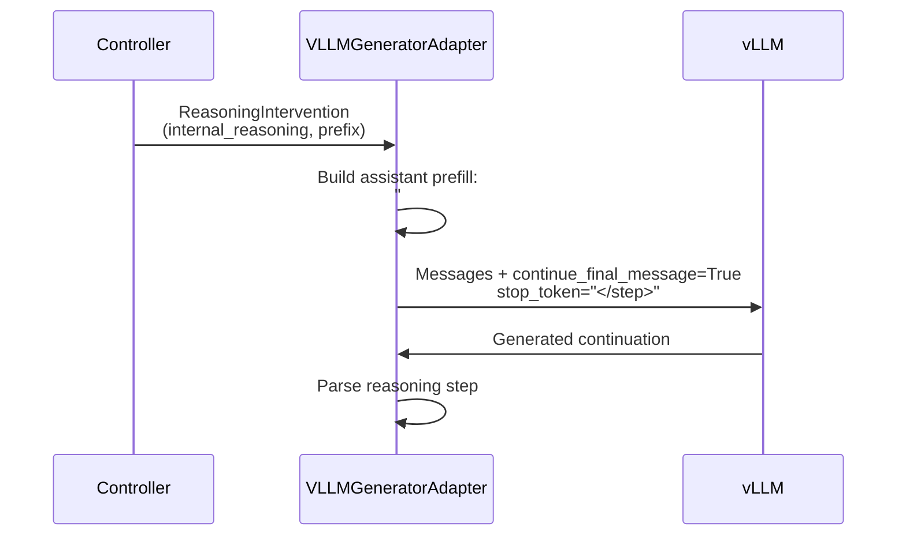

# **STATe-of-Thoughts: Structured Action Templates for Tree-of-Thoughts**

<p align="center">
  
</p>

**STATe-of-Thoughts** (STATe) is an explainable Inference-Time-Compute (ITC) framework that *searches* over high-level reasoning patterns. STATe replaces stochastic temperature-based sampling with discrete, interpretable textual interventions: a **controller** selects actions encoding high-level reasoning choices, a **generator** produces reasoning steps conditioned on those choices, and an **evaluator** scores candidates to guide beam search.

Built on [DSPy](https://github.com/stanfordnlp/dspy) and [vLLM](https://github.com/vllm-project/vllm), this framework enables local LLMs to perform systematic exploration of reasoning trajectories, evaluate intermediate steps (process supervision), and select optimal paths for complex tasks like argumentation, creative writing, and more.

**Key advantages:**
1. **Diversity** -- Action-guided textual interventions produce greater response diversity than temperature-based sampling.
2. **Interpretability** -- Explicit action sequences are highly predictive of output quality.
3. **Controllability** -- Learned associations between actions and outcomes allow steering generation toward promising regions of the action space.

---

## **Background: DSPy Primitives**

This project is built on **DSPy**, leveraging its modular approach to prompt engineering. DSPy separates **what** a task does ([Signature](https://dspy.ai/learn/programming/signatures/)) from **how** it's executed ([Module](https://dspy.ai/learn/programming/modules/) + [Adapter](https://dspy.ai/learn/programming/adapters/) + [LM](https://dspy.ai/learn/programming/language_models/)).

<table>
<tr>
<th align="left">Primitive</th>
<th align="left">Purpose</th>
<th align="left">Example</th>
</tr>
<tr>
<td rowspan="3" valign="middle"><b>Fields</b></td>
<td rowspan="3" valign="middle">Define input/output schema with descriptions</td>
<td><code>topic: str = InputField(desc="The debate topic")</code></td>
</tr>
<tr>
<td><code>stance: Literal["PRO", "ANTI"] = InputField(desc="Position to argue")</code></td>
</tr>
<tr>
<td><code>argument: str = OutputField(desc="The generated argument")</code></td>
</tr>
<tr>
<td><b>Signatures</b></td>
<td>Declarative task specification (what to do)</td>
<td><code>generate_argument = "topic: str, stance: Literal['PRO', 'ANTI'] -> argument: str"</code></td>
</tr>
<tr>
<td><b>Modules</b></td>
<td>Parameterized layers that execute signatures</td>
<td><code>dspy.Predict(generate_argument)</code></td>
</tr>
<tr>
<td><b>Adapters</b></td>
<td>Format prompts from signatures; parse LLM outputs by extracting and type-checking values for each <code>OutputField</code></td>
<td><code>ChatAdapter</code>, <code>JSONAdapter</code></td>
</tr>
</table>

In this document, we will use a running example of **Argument Generation** to illustrate how these primitives come together to implement the STATe-of-Thoughts framework. Another way to define a Signature is through class-based definitions, as shown in the [Signatures page of "Learn DSPy"](https://dspy.ai/learn/programming/signatures/#class-based-dspy-signatures). We use the following Signature for argument generation:

```python
class GenerateArgument(dspy.Signature):
    topic: str = dspy.InputField(desc="The debate topic")
    stance: Literal["PRO", "ANTI"] = dspy.InputField(desc="Position to argue")
    argument: str = dspy.OutputField(desc="The generated argument")
```

#### **Instantiation Phase**

A Module is created by combining a **Signature** (task definition) with a **Language Model** (executes prompts) and **Adapter** (formats prompts and parses outputs).
The Signature specifies *what* to do; the LM and Adapter determine *how*.



#### **Forward (Inference) Phase**

When the Module is called with an [**Example**](https://dspy.ai/learn/evaluation/data/#dspy-example-objects) (which contains values for input fields matching the Signature), the Adapter formats a prompt, the LM generates a response, and the Adapter parses it back into structured fields returned as a **Prediction**. See additional details about Adapters in the [Adapters documentation](https://dspy.ai/learn/programming/adapters/), more on Language Models in the [LM documentation](https://dspy.ai/learn/programming/language_models/), and about Modules in the [Modules documentation](https://dspy.ai/learn/programming/modules/).



---

## **Method**

STATe extends Tree of Thoughts (ToT) with three methodological contributions:

1. **Action-guided interventions** -- Replaces stochastic temperature sampling with discrete action templates that diversify branches in tree search.
2. **Reliable evaluation** -- Supports both verifiable and task-specific LLM-as-a-Judge evaluators to score and select among diverse candidates.
3. **Action attribution** -- Tracks actions along trajectories, enabling systematic analysis of which reasoning patterns drive performance.

### **Tree of Thoughts Components**

STATe instantiates ToT as a modular **Plan &rarr; Generate &rarr; Evaluate &rarr; Select** loop.
At each layer $i$, STATe starts with a list of states, each of the form $s_i = [x, Z_i]$.
$x$ here represents both the task signature and specific input values, and $Z_i$ represents the reasoning steps generated so far.
The controller, $C$, selects $n$ interventions from action space $\mathcal{A}$ for each state in the frontier.
The generator, $G$, then produces completions that extend each of these interventions.
Finally, $V_{\text{PRM}}(s_i)$ scores intermediate trajectories, while $V_{\text{ORM}}(s_i)$ scores trajectories that produced final answers $y$.
The top-$k$ intermediate states (i.e., ones that did not produce final answers) are retained for the next layer (beam selection).



| Step | Component | Function |
|:-----|:----------|:---------|
| **Plan** | Controller ($C$) | Selects actions $\{a_i^1, \ldots, a_i^n\} = C(s_{i-1}, \mathcal{A}, n)$ |
| **Generate** | Generator ($G$) | Produces candidates $z_i^j \sim G(s_{i-1}, \text{prefill}(Z_{i-1}, a_i^j()); \text{temp})$ |
| **Evaluate** | Evaluator ($V$) | Scores intermediate states: $V_{\text{PRM}}(s_i)$; scores final states: $V_{\text{ORM}}(s_i)$ |
| **Select** | Beam Search | Keeps top-k candidates from $L_i'$ ranked by score v |

---

### **1. Core Modules (`predict/`)**

Three modules implement the Plan &rarr; Generate &rarr; Evaluate &rarr; Select cycle. Each module wraps an LLM and uses adapters to format prompts and parse outputs.

<table>
<tr>
<th align="left">Module</th>
<th align="left">Role</th>
<th align="left">Input</th>
<th align="left">Output</th>
</tr>
<tr>
<td><b>Controller</b></td>
<td>Select actions from action space</td>
<td>State s<sub>i-1</sub>, action space A</td>
<td>Actions {a<sub>i</sub><sup>1</sup>, ..., a<sub>i</sub><sup>n</sup>}, each yielding a <code>ReasoningIntervention</code></td>
</tr>
<tr>
<td><b>Generator</b></td>
<td>Produce candidate reasoning steps or final answers</td>
<td>State + ReasoningIntervention (prefix, internal_reasoning)</td>
<td>Reasoning step z<sub>i</sub> or final answer y</td>
</tr>
<tr>
<td><b>Evaluator</b></td>
<td>Score candidate states</td>
<td>Child state (candidate)</td>
<td>Scalar score in [0, 1]</td>
</tr>
</table>

---

#### **Controller**

The Controller ($C$) observes the current state and selects actions from an action space $\mathcal{A}$. Each action is treated as a *tool call*: selecting an action corresponds to choosing a tool name and providing values for its arguments (if any). Executing the tool returns a `ReasoningIntervention` -- a structured object containing an `internal_reasoning` string (guidance injected into context) and a `prefix` string (text pre-filled at the start of the next generation).

Two controller implementations exist:

**Generative Controller** (`TreeOfThoughtsController`): Uses a generative LLM to produce tool calls. Creates a *single combined tool* with one parameter per action-space dimension. The model generates one choice per parameter.



> **Note:** When sampling multiple actions, the generative controller tracks co-occurrence counts for duplicate (tool, arguments) pairs. This allows promising actions to be sampled $n$ times (where $n$ is the occurrence count), or executed once if deduplication is preferred.

**Reranker Controller** (`TreeOfThoughtsControllerReranker`): Scores all action-argument combinations using a discriminative reranker model. Creates *one tool per combination* of choices across all dimensions, then scores each tool's description against the current state.



**Controller Output**: Both controllers produce `ControllerPrediction` objects containing:

| Field | Description | Example |
|:------|:------------|:--------|
| `tool` | The selected `dspy.Tool` | tool for `"select_reasoning_intervention"` or `"finish"` |
| `chosen_values` | Tool arguments (if any) | `{"causal_structures": "causal_reasoning", "causal_subtopics": "justice_and_fairness"}` |
| `intervention` | `ReasoningIntervention` from executing the tool | `ReasoningIntervention(continue_reasoning=True, internal_reasoning="I should analyze whether...", prefix="Therefore")` |
| `considerations` | Rationale for the choice | `"The argument needs causal structure..."` |
| `intervention.continue_reasoning` | Whether to generate another reasoning step | `True` / `False` |

---

#### **Defining Action Spaces (Tools)**

Action spaces define the dimensions along which STATe's controller can intervene on reasoning. Each dimension (e.g., *structure*, *style*, *subtopic*) is specified as a **JSON file** with a name, a definition, and a dictionary of choices. Each choice maps to intervention fields (`internal_reasoning` and/or `prefix`) that are injected into the generator's next step.

**Action Space JSON Schema:**

```json
{
  "name": "<Dimension Name>",
  "definition": "<Description of what interventions along this dimension do>",
  "choices": {
    "<choice_key>": {
      "definition": "<What this choice does>",
      "internal_reasoning": "<Guidance injected into context (optional)>",
      "prefix": "<Text pre-filled at start of generation (optional)>"
    }
  }
}
```

> **Important:** Only one dimension can provide a `prefix`, since the prefix occupies a fixed position at the start of the generated text. All dimensions can contribute `internal_reasoning` (their guidance strings are concatenated).

**Example: Argument Generation Action Spaces**

STATe's argument generation experiment uses three action-space dimensions:

**1. Structures** (`experiments/argument_generation/action_space/structures.json`) -- Controls discourse structure via a prefix:

```json
{
  "name": "Structures",
  "definition": "Forces the next reasoning step to adhere to a specific discourse structure...",
  "choices": {
    "causal_reasoning": {
      "definition": "States causes, effects, consequences, or logical implications.",
      "prefix": "Therefore"
    },
    "conditional": {
      "definition": "Introduces conditional, hypothetical, or counterfactual scenarios.",
      "prefix": "If"
    },
    "concession_and_contrast": {
      "definition": "Acknowledges counterpoints or highlights opposing perspectives.",
      "prefix": "However"
    },
    "exemplification": {
      "definition": "Provides concrete examples, illustrations, or case studies.",
      "prefix": "For example"
    }
  }
}
```

**2. Subtopics** (`experiments/argument_generation/action_space/subtopics.json`) -- Controls content theme via internal reasoning:

```json
{
  "name": "Subtopics",
  "definition": "Forces the next reasoning step to analyze the issue through a specific argumentative lens...",
  "choices": {
    "cost_benefit_and_impact_analysis": {
      "definition": "Weighs economic, social, and practical consequences systematically",
      "internal_reasoning": "I should quantify and compare costs, benefits, and real-world impacts..."
    },
    "rights_and_liberties": {
      "definition": "Protects fundamental rights, freedoms, privacy, and individual autonomy",
      "internal_reasoning": "I should consider inalienable human rights, civil liberties..."
    }
  }
}
```

**3. Styles** (`experiments/argument_generation/action_space/styles.json`) -- Controls rhetorical style via internal reasoning:

```json
{
  "name": "Causal Styles",
  "definition": "Forces the next reasoning step to adopt a specific rhetorical style...",
  "choices": {
    "figurative_language": {
      "definition": "Uses metaphor, simile, analogy, or symbolism...",
      "internal_reasoning": "I should employ non-literal comparison to make abstract concepts vivid..."
    },
    "statistical_and_data_driven": {
      "definition": "Presents numerical data, statistics, or quantified evidence.",
      "internal_reasoning": "I should use numbers and data to provide concrete, measurable support..."
    }
  }
}
```

**How controllers use action spaces:**

- The **generative controller** creates a *single combined tool* with one parameter per dimension. The LLM generates a choice for each parameter (e.g., `{"causal_structures": "causal_reasoning", "causal_subtopics": "justice_and_fairness", "causal_styles": "statistical_and_data_driven"}`). Executing the tool combines the `internal_reasoning` and `prefix` from all chosen values.

- The **reranker controller** creates *one tool per combination* of choices across all dimensions (e.g., 10 structures &times; 10 subtopics &times; 10 styles = 1,000 tools). Each tool has a description derived from its choices, and the reranker scores all tools against the current state to select the top-$n$.

**Creating action spaces for your own tasks:**

1. **Identify controllable dimensions** -- Enumerate aspects of generation that can be meaningfully controlled at each step (content, structure, style, strategy).
2. **Decide prefix vs. internal reasoning** -- Only one dimension can use a prefix; all can use internal reasoning. Structural/discourse dimensions benefit most from prefix control.
3. **Consider early stopping** -- Include a `finish` tool if variable-depth reasoning is desired. The finish tool is automatically added when `early_stopping_enabled=True` (the default).
4. **Topic-specific subtopics** -- You can create topic-specific action spaces (see `subtopics_specific_pollution.json` for an example tailored to single-use plastics).

See Appendix C of the paper for detailed practitioner guidance on action space design.

---

#### **Generator**

The Generator ($G$) expands the reasoning tree by producing candidate thoughts $z_i^j$ or final outputs $y$. Given a parent state $s_{i-1} = [x, Z_{i-1}]$ and an action $a_i^j$, we sample a continuation:

$$z_i^j \sim p_\theta(z \mid x, \text{prefill}(Z_{i-1}, a_i^j()); \text{temp})[\text{stop\_token}]$$

The prefill operation ensures that the model's generation begins with the intervention text, biasing reasoning along the desired dimension. Stop tokens (`</step>` for reasoning, `</answer>` for final output) control when generation halts.



**Synthesis Modes:**
Once the maximum depth $d$ is reached or the controller selects `FINISH`, STATe synthesizes a final output from the reasoning trace. Four modes are supported:

| Mode | Description |
|:-----|:------------|
| **Strict** | Concatenates reasoning steps verbatim with minimal connectives |
| **Faithful** | Permits rephrasing while preserving order and structure |
| **Restructured** | Allows free reorganization using the trace as source material |
| **Conclusion** | Treats the trace as internal guidance only; no constraints on final output |

---

#### **Evaluator**

The Evaluator ($V$) assigns scalar scores to guide beam search:

- **PRM (Process Reward Model)**: Scores intermediate reasoning states $V_{\text{PRM}}(s_i) \to [0,1]$ where $s_i = [x, Z_i]$
- **ORM (Outcome Reward Model)**: Scores final states $V_{\text{ORM}}(s_i) \to [0,1]$ where $s_i = [x, Z_{i-1}, y]$

Three evaluator implementations are supported:
1. **Generative LLM-as-a-Judge** -- Scores candidates against a rubric
2. **Reranker LLM-as-a-Judge** -- Assigns latent relevance scores
3. **Deterministic verifier** -- Programmatic evaluation (e.g., code correctness)



**Weighted Rubrics**: The evaluator can use `rubric_weight` from the signature to combine multiple dimensions:

$$\text{score} = \sum_i (\text{score}_i \times \text{weight}_i)$$

---

### **2. Signatures & Fields (`signatures/`)**

Signatures define task schemas. We extend DSPy with `ReasoningSignature` and `ReasoningField`.

#### **ReasoningSignature**

A signature with three field types:

| Field Type | Class | Notation | Generated When |
|:-----------|:------|:---------|:---------------|
| **Input** | `InputField` | $x$ | Provided by user |
| **Reasoning** | `ReasoningField` | $z$ | Each step (iteratively) |
| **Output** | `OutputField` | $y$ | When controller says `FINISH` or max depth reached |

```python
from signatures import ReasoningSignature, InputField, ReasoningField, OutputField

class ArgumentGeneration(ReasoningSignature):
    """Generate an argument for the given stance on the topic."""
    
    # Inputs (x) - provided by user
    topic: str = InputField(desc="The topic of the argument")
    stance: str = InputField(desc="The stance to argue for (PRO or ANTI)")
    
    # Reasoning (z) - generated iteratively, one per step
    claim: str = ReasoningField(desc="A supporting claim for the stance")
    
    # Output (y) - generated when reasoning is complete
    argument: str = OutputField(desc="The final synthesized argument")
```

#### **Extended Field Features**

**ReasoningField**: Forces structured intermediate steps. The model generates one value per reasoning step until the Controller decides to finish or the maximum number of steps is reached.

**rubric_weight**: Enables weighted multi-dimensional evaluation:

```python
class EvaluateArgument(ReasoningSignature):
    """Evaluate an argument on multiple dimensions."""
    argument: str = InputField(desc="The argument to evaluate")
    
    # Weighted scoring: 30% + 30% + 40% = 100%
    persuasiveness: int = OutputField(
        desc="How convincing (1-7)", rubric_weight=0.3, ge=1, le=7
    )
    coherence: int = OutputField(
        desc="How well-structured (1-7)", rubric_weight=0.3, ge=1, le=7
    )
    relevance: int = OutputField(
        desc="How on-topic (1-7)", rubric_weight=0.4, ge=1, le=7
    )
```

**Pydantic Constraints**: Automatically translated to prompt instructions:

```python
# Generates: "Each claim should be between 2 and 5 sentences."
claim: str = ReasoningField(min_length=2, max_length=5, granularity="sentence")
```

---

### **3. Adapters (`adapter/`)**

Adapters translate abstract signatures into concrete LLM prompts and parse outputs back into structured data.



#### **VLLMGeneratorAdapter**

The core adapter for multi-step reasoning with four key capabilities:

**1. XML-based Reasoning Template**

Structures LLM responses using XML tags:

```text
<thinking>
<step>
## internal_reasoning
I should introduce my primary claim
## claim
Studies show that renewable energy reduces costs...
</step>
<step>
## internal_reasoning
I should acknowledge counterarguments
## claim
While opponents argue that...
</step>
...
</thinking>
<answer>
## argument
Renewable energy is economically beneficial because...
</answer>
```

We recognize natural "stopping points" in the model's response through XML tags like `</step>` and `</answer>`. We introduce interventions by injecting internal reasoning and the first few tokens of the reasoning step (prefix) before the model continues generating.

**2. Stop Token Control**

| Controller Decision | Stop Token | Result |
|:--------------------|:-----------|:-------|
| `continue_reasoning=True` | `</step>` | One reasoning step |
| `continue_reasoning=False` | `</answer>` | Final output |

**3. Assistant Pre-filling**

Injects controller interventions using vLLM's `continue_final_message`:



**4. Heterogeneous Batching**

Process mixed batches where each item independently continues reasoning or generates output:

```python
outputs = adapter(
    signature=ArgumentGeneration,
    inputs={"topic": "AI", "stance": "PRO"},
    continue_reasoning=[
        [True],   # Trajectory 1: Generate another step
        [False],  # Trajectory 2: Generate final answer
    ],
    previous_content=[traj1_history, traj2_history],
    lm_kwargs={"temperature": 0.7, "n": 2},
)
# Returns: [[step1a, step1b], [answer2a, answer2b]]
```

---

## **Quick Start**

Here is a minimal example of running a Tree of Thoughts pipeline:

```python
from lm.generative_local_lm import GenerativeLocalVLLM
from lm.scoring_local_lm import ScoringLocalVLLM
from predict.tree_of_thoughts import TreeOfThoughts
from signatures import ReasoningSignature, InputField, ReasoningField, OutputField

# 1. Define Signatures
class QuestionAnsweringWithReasoning(ReasoningSignature):
    """Answer the question by reasoning step-by-step."""
    question: str = InputField(desc="The question to answer")
    reasoning_step: str = ReasoningField(desc="A step in the reasoning process")
    answer: str = OutputField(desc="The final answer")

class EvaluateAnswer(ReasoningSignature):
    """Evaluate the quality of an answer."""
    question: str = InputField(desc="The original question")
    answer: str = InputField(desc="The answer to evaluate")
    score: int = OutputField(desc="Quality score 1-10", ge=1, le=10)

# 2. Initialize Models
generative_lm = GenerativeLocalVLLM(model="Qwen/Qwen3-30B-A3B-Instruct-2507", task="generate")
evaluator_lm = ScoringLocalVLLM(model="Qwen/Qwen3-Reranker-8B", task="score")

# 3. Configure Tree of Thoughts
tot = TreeOfThoughts(
    generator_signature=QuestionAnsweringWithReasoning,
    evaluator_signature=EvaluateAnswer,
    generative_lm=generative_lm,
    evaluator_lm=evaluator_lm,
)

# 4. Run Inference
output = tot(
    question="What are the long-term economic effects of AI?",
    max_depth=3,
    top_k=2
)

print(f"Final Answer: {output.answer}")
```

---

## **Documentation Map**

- **[Signatures (signatures/)](signatures/README.md)**: Custom fields and reasoning schemas

---

## **Installation**

### **Prerequisites**

- **Python 3.12+**
- **GPUs:** Recommended setup is 2 GPUs (e.g., GPU 0 for Generation, GPU 1 for Reranking)

### **Environment Setup**

```bash
# Create environment
conda create -n dspy_reasoning_env python=3.12
conda activate dspy_reasoning_env

# Install dependencies
pip install -r requirements_server.txt

# Download models
huggingface-cli download Qwen/Qwen3-30B-A3B-Instruct-2507 \
    --local-dir /path/to/model_storage/Qwen3-30B-A3B-Instruct-2507
```

---

## **Usage: Running Experiments**

The main entry point is `experiments/argument_generation/run_argument_generation.py`:

```bash
python experiments/argument_generation/run_argument_generation.py \
    --experiment_mode synthesis_faithful \
    --do_pruning \
    --do_save_tree \
    --outputs_directory ./experiments/argument_generation/tot_outputs \
    --outputs_filename argument_generation_depth_3_bf_5_top_k_2 \
    --depth 3 \
    --generator_temperature 0.7 \
    --n_samples_generation 5 \
    --top_k 3 \
    --n_samples_judge 5 \
    --judge_temperature 0.7 \
    --action_space_paths \
      ./experiments/argument_generation/action_space/subtopics.json \
      ./experiments/argument_generation/action_space/styles.json \
      ./experiments/argument_generation/action_space/structures.json
```

> **Note:** This script requires **two separate GPUs** by default -- one for the generative model (Generator, Evaluator, and optionally the generative Controller) and one for the reranker model (Controller action scoring).

### **Key Flags**

| Flag | Description | Default |
|:-----|:------------|:--------|
| `--model` | Generative model name | `Qwen3-30B-A3B-Instruct-2507` |
| `--reranker_model` | Reranker model for scoring | `Qwen3-Reranker-8B` |
| `--model_directory` | Directory containing downloaded models | `/projects/BSTEWART/model_storage` |
| `--generative_gpu_index` | GPU index for generative model | `0` |
| `--reranker_gpu_index` | GPU index for reranker model | `1` |

**Tree Search Parameters:**

| Flag | Description | Default |
|:-----|:------------|:--------|
| `--depth` | Maximum depth of reasoning tree ($d$) | `2` |
| `--n_samples_generation` | Branching factor / candidates per node ($n$) | `3` |
| `--top_k` | Beam width ($k$) | `2` |
| `--do_pruning` | Enable pruning low-scoring nodes | `False` |
| `--use_self_consistency` | Enable self-consistency voting | `False` |
| `--num_final_candidates` | Number of final outputs to return | `1` |
| `--action_space_paths` | Paths to action space JSON files (one per dimension) | `None` |

**Generation Parameters:**

| Flag | Description | Default |
|:-----|:------------|:--------|
| `--generator_temperature` | Temperature for generation | `1.0` |
| `--controller_temperature` | Temperature for generative controller | `1.2` |
| `--judge_temperature` | Temperature for evaluator | `0.7` |
| `--experiment_mode` | Final output method: `synthesis_strict`, `synthesis_faithful`, `synthesis_restructured`, or `conclusion` | `synthesis_faithful` |

**Output & Logging:**

| Flag | Description | Default |
|:-----|:------------|:--------|
| `--do_save_tree` | Save full tree structure to disk | `False` |
| `--outputs_directory` | Directory for saved outputs | Current directory |
| `--outputs_filename` | Filename for outputs (auto-timestamped if not set) | `None` |
| `--verbosity` | Logging level: `debug`, `info`, `warning`, `error` | `info` |

---

## **Testing**

The test suite includes both **mock-based unit tests** (fast, no GPU required) and **integration tests** (require GPU access).

### **Mock-Based Unit Tests**

Unit tests use `MockLocalVLLM` from `utilities_for_tests.py` to simulate model responses without requiring actual GPU resources:

```bash
# Run all unit tests (from the root directory)
pytest .

# Individual components
pytest lm/test_generative_local_lm.py                       # Generative LLM (vLLM)
pytest lm/test_scoring_local_lm.py                          # Scoring/reranker LLM (vLLM)
pytest signatures/test_field.py                             # Fields
pytest signatures/test_signature.py                         # Signatures
pytest adapter/test_vllm_adapter.py                         # Generative adapter (direct generation)
pytest adapter/test_vllm_scoring_adapter.py                 # Scoring/reranker adapter
pytest adapter/test_vllm_generator_adapter.py               # Generator adapter (multi-step reasoning)
pytest adapter/test_constraints.py                          # Response length constraints
pytest adapter/test_tool_schema.py                          # Tool schema formatting
pytest adapter/test_utils.py                                # Adapter utilities
pytest predict/controller/test_controller.py                # Generative controller
pytest predict/controller/test_controller_reranker.py       # Reranker controller
pytest predict/controller/test_controller_utils.py          # Controller utilities
pytest predict/generator/test_generator.py                  # Generator
pytest predict/evaluator/test_evaluator.py                  # Generative evaluator
pytest predict/evaluator/test_evaluator_reranker.py         # Reranker evaluator
pytest predict/test_local_predict.py                        # Local predict module
pytest predict/tree_of_thoughts/test_tree_of_thoughts.py    # Tree of Thoughts (end-to-end)
pytest tree/test_tree.py                                    # Tree data structures
pytest test_misc_utils.py                                   # Miscellaneous utilities
pytest test_utilities_for_tests.py                          # Test utilities (MockLocalVLLM)
```

### **Integration Tests**

Integration tests require access to GPUs and run against real models. Simply run the same tests as above in a system with GPUs, and integration tests will run rather than get skipped.
