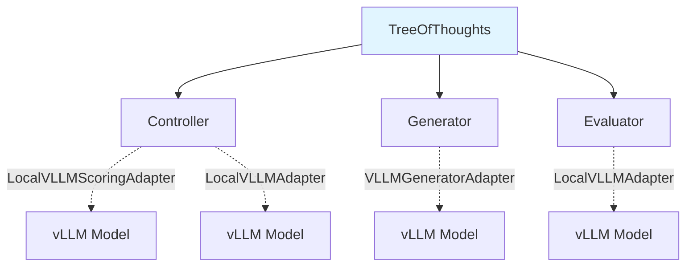
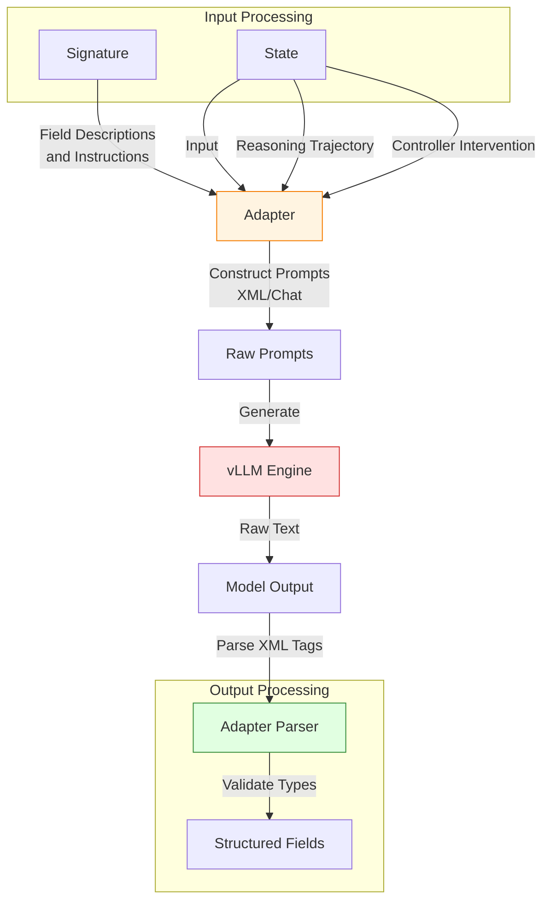

# Adapters

This directory contains **Adapters**, which serve as the bridge between abstract DSPy Signatures and the concrete prompt formats (often a sequence of `Message` objects with `role` and `content` fields) required by the underlying Language Model.

## Overview

Adapters translate high-level DSPy task definitions into model-specific formats and parse model outputs back into structured data. The adapter layer enables:
- **Signature-based prompting**: Automatic conversion of DSPy signatures and corresponding examples into LLM-compatible prompts (for chat models, this creating sequences of messages, and for re-ranking models, creating query-document pairs)
- **Multi-step reasoning**: Support for iterative reasoning with state management
- **Flexible generation control**: Length constraints, controller interventions, and custom tool integration

---

## Core Components

### 1. `VLLMAdapter` (`vllm_adapter.py`)
The **base adapter** for interacting with vLLM models.

**Responsibilities:**
- Formats prompts based on DSPy signatures and input arguments
- Manages vLLM sampling parameters (temperature, top_k, top_p, etc.)
- Parses model output back into structured fields

**Use Case:** General-purpose adapter serving as the foundation for specialized adapters.

---

### 2. `VLLMGeneratorAdapter` (`vllm_generator_adapter.py`)
A specialized extension of `VLLMAdapter` designed for **multi-step reasoning** in the Tree of Thoughts framework.

**Key Features:**
- **Reasoning Support:** Handles `ReasoningField` to enforce structured intermediate reasoning steps
- **State Management:** Incorporates `previous_content` (history of reasoning steps) into prompts to enable iterative reasoning
- **Controller Integration:** Supports complex controller actions. The most basic decision the controller can make is whether or not to perform "early-stopping" (i.e., deciding to generate a final answer before the maximum number of reasoning steps designated by the user). The controller decides this by specifying whether the next action should involve `continue_reasoning` or `finish` (via the `finish` tool). The controller can also use custom tools (e.g., argument generation tools with multi-dimensional control) that return:
  - `INTERNAL_REASONING`: First-person planning guidance that influences how the LLM approaches the next reasoning step (e.g., "I should analyze costs, benefits, and market effects")
  - `PREFIX`: Text directly prepended to the next reasoning step to constrain generation (e.g., "For example" forces the model to generate an example)
  - Tool-specific arguments and their chosen values for fine-grained control (e.g., `subtopic="Economic Impact"`, `style="Knowledge"`, `structure="Cause"`)
  - **NOTE**: All tools specify whether or not to generate a final answer (vs. performing additional reasoning) and optionally provide interventions in the form of internal reasoning and/or prefix text to guide the next generation. The interventions are directly prepended to the next generation in the reasoning trajectory so as to influence *how* the model should go about producing its next generation.
- **Reasoning Template:** Introduces new templates for how to format responses to reasoning tasks. There are two new reasoning templates (which extend DSPy's template for general tasks in their `ChatAdapter`):
  - `GENERATOR_SYSTEM_PROMPT_VANILLA`: Standard reasoning prompt without controller guidance
  - `GENERATOR_SYSTEM_PROMPT_INTERNAL_REASONING`: Enhanced prompt supporting controller interventions
- **Constraint Handling:** Injects instructions for length constraints on both reasoning steps and final responses (e.g., limiting the content of reasoning steps to 3 sentences and the final answer to 5 paragraphs). 
- **Heterogeneous Batching:** Processes mixed batches of reasoning continuation and final answer generation in a single forward pass

**Use Case:** Primary adapter for the Tree of Thoughts generator module (`predict/generator.py`).

**How It Works:**
1. Receives inputs, previous reasoning steps (reasoning trajectories), and controller outputs (interventions)
2. Formats conversation history with XML-style tags (`<thinking>`, `<step>`, `<answer>`)
3. Applies controller interventions (internal reasoning + prefix) to guide next generation
4. Determines stop tokens based on whether continuing reasoning or generating final answer
5. Parses model output into reasoning fields or output fields based on the controller's choice of whether to continue reasoning or generate a final answer.

---

### 3. `LocalVLLMScoringAdapter` (`vllm_scoring_adapter.py`)
An adapter specifically designed for **scoring and reranking** tasks using `LocalVLLM` with `task="score"`.

**Function:** Formats inputs into query-document pairs for reranker models (e.g., reward models).

**Scoring Targets:**
- `REASONING`: Evaluates the quality of intermediate reasoning trajectories.
- `OUTPUT`: Evaluates the quality of final answers.
- `ACTION`: Evaluates the relevance of potential controller actions given the input and reasoning trajectory (used by reranker-based controller).

**Features:**
- **Broadcasting:** Efficiently scores multiple candidates against a single context using vLLM's broadcasting capabilities (used for the Reranker Controller defined in `reranker_controller.py`).
- **Flexible Evaluation:** Supports both Process Reward Models (PRM) for reasoning steps and Outcome Reward Models (ORM) for final outputs
- **Batch Processing:** Handles multiple states and candidates in a single scoring call

**Use Case:**
- Evaluator module for scoring reasoning quality
- Reranker-based controller for action selection

---

## Supporting Modules

### `constraints.py`
Defines response length constraints for generation:
- `ResponseLength`: Configurable constraints on word count, sentence count, or token count
- Helper functions for formatting constraint instructions into prompts

### `prompts.py`
Contains system prompt templates for different adapter modes:
- `GENERATOR_SYSTEM_PROMPT_VANILLA`: Standard reasoning prompt without controller guidance
- `GENERATOR_SYSTEM_PROMPT_INTERNAL_REASONING`: Enhanced prompt supporting controller interventions

### `utils.py`
Utility functions for prompt formatting:
- Field description formatting
- Output field section generation
- Constraint instruction formatting

---

## Architecture Integration

### Tree of Thoughts Pipeline



1. **Controller** uses `LocalVLLMScoringAdapter` (reranker mode) or `LocalVLLMAdapter`
2. **Generator** uses `VLLMGeneratorAdapter` to produce reasoning steps or final answers
3. **Evaluator** uses `LocalVLLMAdapter` to score reasoning quality

### Data Flow & Examples

The adapter pipeline transforms abstract signatures into concrete prompts and back.



#### Example: Transformation Pipeline

**1. Input (Signature & State)**
```python
# Signature: question -> reasoning -> answer
# State: question="Why is the sky blue?"
# Controller: continue_reasoning=True
```

**2. Generated Prompt (Simplified)**
```text
<system>
You are a helpful assistant. Follow the format:
<thinking>Reasoning steps here...</thinking>
<answer>Final answer here...</answer>
</system>

<user>
Why is the sky blue?
</user>

<assistant>
<thinking>
```

**3. Model Output**
```text
The sky appears blue due to Rayleigh scattering.
</thinking>
```

**4. Parsed Result**
```python
{
    "reasoning": "The sky appears blue due to Rayleigh scattering."
}
```

## Design Principles

1. **Separation of Concerns**: Adapters handle formatting/parsing; modules handle logic
2. **Signature-Driven**: All prompts derive from DSPy signatures for consistency
3. **Extensibility**: New adapters can extend base classes for specialized tasks
4. **Type Safety**: Strong typing for inputs/outputs to catch errors early

---

## Testing

Each adapter has comprehensive test coverage:
- `test_vllm_adapter.py`: Base adapter functionality
- `test_vllm_generator_adapter.py`: Multi-step reasoning and controller integration
- `test_vllm_scoring_adapter.py`: Scoring and reranking behavior
- `test_constraints.py`: Length constraint formatting
- `test_utils.py`: Utility function correctness

Run tests with:
```bash
pytest adapter
```
