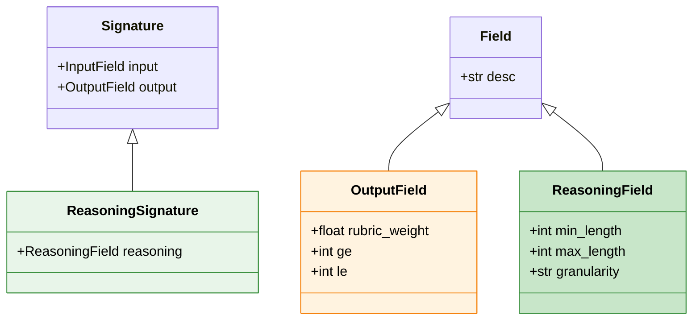

# Signatures & Fields (`signatures/`)

This directory defines custom **DSPy Signatures** and **Fields** that structure the reasoning process in our Tree of Thoughts framework.

---

## Overview

Signatures define task schemas. We extend DSPy with `ReasoningSignature` and `ReasoningField` to support structured multi-step reasoning.



---

## ReasoningSignature (`signature.py`)

A signature with three field types that explicitly supports intermediate reasoning steps:

| Field Type | Class | Notation | Generated When |
|:-----------|:------|:---------|:---------------|
| **Input** | `InputField` | $x$ | Provided by user |
| **Reasoning** | `ReasoningField` | $z$ | Each step (iteratively) |
| **Output** | `OutputField` | $y$ | When controller says `finish` |

### Structure

```
Input → Reasoning → Output
  x   →    z      →   y
```

### Features

- Allows defining signatures using string notation (e.g., `"question -> reasoning -> answer"`).
- Ensures that the `reasoning` field is treated as an intermediate step, not just another output.
- When executing a chain or tree of thoughts with a `ReasoningSignature`, the model can produce either zero, one, or many intermediate steps before producing the final answer.

### Example: Argument Generation

```python
from signatures import ReasoningSignature, InputField, ReasoningField, OutputField

class ArgumentGeneration(ReasoningSignature):
    """Generate an argument for the given stance on the topic."""
    
    # Inputs (x) - provided by user
    topic: str = InputField(desc="The topic of the argument")
    stance: str = InputField(desc="The stance to argue for (PRO or ANTI)")
    
    # Reasoning (z) - generated iteratively, one per step
    claim: str = ReasoningField(desc="A supporting claim for the stance")
    
    # Output (y) - generated when reasoning is complete
    argument: str = OutputField(desc="The final synthesized argument")
```

### Example: Math Reasoning

```python
class MathReasoning(ReasoningSignature):
    """Solve math problems with step-by-step reasoning."""
    
    question: str = InputField(desc="The math problem to solve")
    reasoning: str = ReasoningField(desc="Step-by-step calculation")
    answer: str = OutputField(desc="The final numeric answer")

# Or using string notation
sig = ReasoningSignature("question -> reasoning -> answer")
```

---

## ReasoningField (`field.py`)

A custom field type for defining intermediate thoughts.

- **Purpose:** Unlike standard `InputField` or `OutputField`, a `ReasoningField` represents the "hidden" chain of thought that leads to the final output.
- **Usage:** Used in signatures to enforce that the model produces a structured reasoning step (e.g., a claim, a calculation, or a plan) before the final answer.

### Features

**Forces structured intermediate steps.** The model generates one value per reasoning step until the Controller decides to finish.

### Pydantic Constraints

Constraints are automatically translated to prompt instructions:

```python
# Generates: "Each claim should be between 2 and 5 sentences."
claim: str = ReasoningField(
    desc="A supporting claim",
    min_length=2,
    max_length=5,
    granularity="sentence"
)
```

| Constraint | Description | Example |
|:-----------|:------------|:--------|
| `min_length` | Minimum length | `2` |
| `max_length` | Maximum length | `5` |
| `granularity` | Unit of measurement | `"sentence"`, `"word"`, `"paragraph"` |

---

## rubric_weight (`field.py`)

A metadata attribute for `OutputField` used in evaluation.

- **Purpose:** Allows assigning weights to different dimensions in an evaluation signature.
- **Math:** The final score is calculated as the weighted sum of individual field scores:

$$\text{score} = \frac{\sum (s_i \cdot w_i)}{\sum w_i}$$

### Example: Weighted Evaluation Rubric

```python
class EvaluateArgument(ReasoningSignature):
    """Evaluate an argument on multiple dimensions."""
    argument: str = InputField(desc="The argument to evaluate")
    
    # Weighted scoring: 30% + 30% + 40% = 100%
    persuasiveness: int = OutputField(
        desc="How convincing (1-7)", rubric_weight=0.3, ge=1, le=7
    )
    coherence: int = OutputField(
        desc="How well-structured (1-7)", rubric_weight=0.3, ge=1, le=7
    )
    relevance: int = OutputField(
        desc="How on-topic (1-7)", rubric_weight=0.4, ge=1, le=7
    )
```

The `TreeOfThoughtEvaluator` uses these weights to calculate a weighted average score.

### Pydantic Validation Constraints

OutputFields support Pydantic-style constraints:

| Constraint | Description | Example |
|:-----------|:------------|:--------|
| `ge` | Greater than or equal to | `ge=1` |
| `le` | Less than or equal to | `le=7` |
| `rubric_weight` | Weight for evaluation scoring | `0.3` |

---

## Example Signatures

### Question Answering with Reasoning

```python
class QuestionAnsweringWithReasoning(ReasoningSignature):
    """Answer questions with step-by-step reasoning."""
    
    question: str = InputField(desc="The question to answer")
    reasoning_step: str = ReasoningField(desc="A step in the reasoning process")
    answer: str = OutputField(desc="The final answer")
```

### Argument Generation

```python
class GenerateArgumentWithReasoning(ReasoningSignature):
    """Generate an argument for the given stance on the topic."""
    
    topic: str = InputField(desc="The topic of the argument")
    stance: ArgumentStance = InputField(desc="The stance to argue for")
    claim: str = ReasoningField(desc="A supporting claim for the stance")
    argument: str = OutputField(desc="The final synthesized argument")
```
